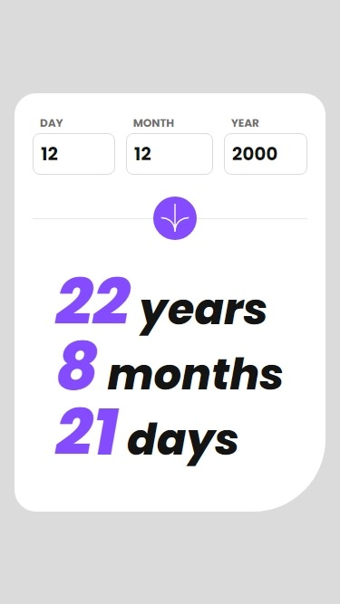
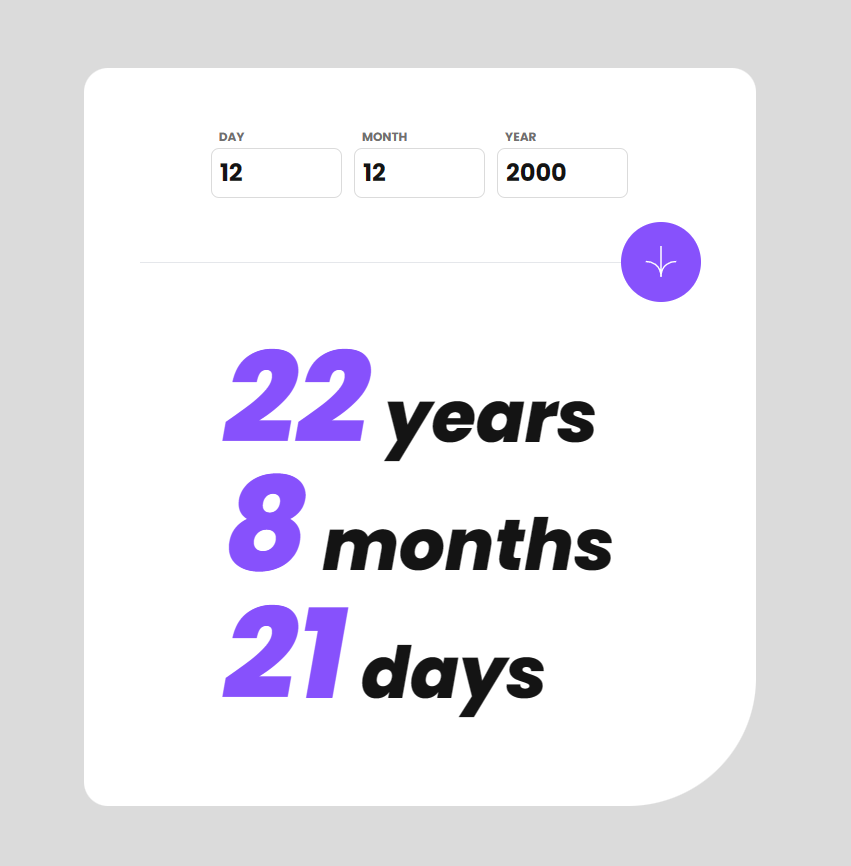

# Frontend Mentor - Age calculator app

## Table of contents

- [Overview](#overview)
  - [The challenge](#the-challenge)
  - [Screenshot](#screenshot)
  - [Links](#links)
- [My process](#my-process)
  - [Built with](#built-with)
  - [What I learned](#what-i-learned)
  - [Continued development](#continued-development)
- [Author](#author)

## Overview

### The challenge

Your users should be able to:
- View an age in years, months, and days after submitting a valid date through the form
- Receive validation errors if:
  - Any field is empty when the form is submitted
  - The day number is not between 1-31
  - The month number is not between 1-12
  - The date is in the future
  - The date is invalid e.g. 31/04/1991 (there are 30 days in April)
- View the optimal layout for the interface depending on their device's screen size
- See hover and focus states for all interactive elements on the page
- **Bonus**: See the age numbers animate to their final number when the form is submitted

### Screenshot

- Mobile:\
\

- Desktop:\
\

### Links

- Solution URL: [Age calculator app Solution](https://github.com/kietly2k/simple-projects/tree/age-caculator/src/components/age-caculator)
- Live Site URL: [Age calculator app Live Site](https://kietly2k.github.io/practiceprojects/simple-projects/age-calculator)

## My process

### Built with

- Mobile-first workflow
- Tailwind CSS

### What I learned

- How to use Tailwind CSS to create a simple calculate age app.
- Handle responsive for all screen size using Tailwind CSS.
- Practice react.

### Continued development

- Keep practie ReactJS

## Author

- Github: [Kiet Ly - Fullstack developer](https://github.com/kietly2k)
- Frontend Mentor: [kietly2k](https://www.frontendmentor.io/profile/kietly2k)